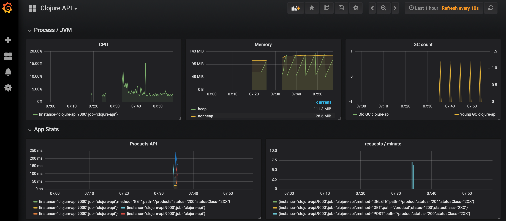
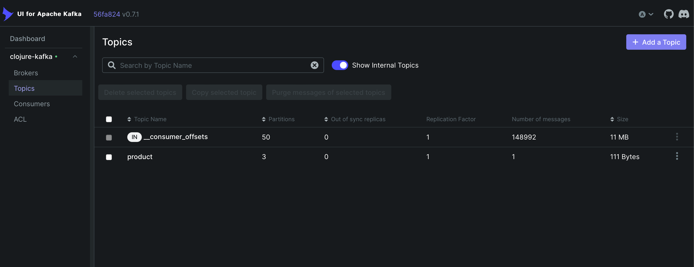
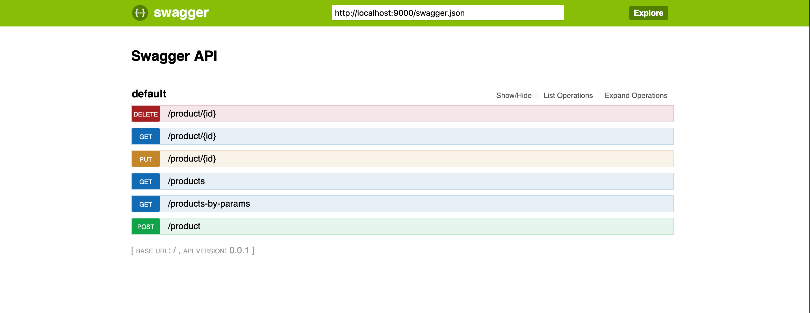
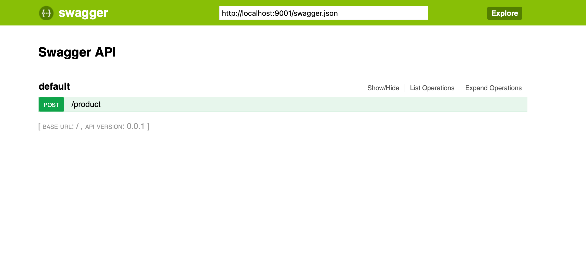

# Clojure and Datomic Studies with Docker and Kafka

<p align="center">
    
    
    
    
</p>

Welcome to my monorepo project dedicated to exploring Clojure and Datomic while leveraging Docker and Kafka technologies. This repository documents my study path and progress as I delve into these exciting areas of software development.

## Project Structure

The repository is organized into the following sections:

- `clojure-api`: Contains Web API projects built with Clojure.
- `clojure-async`: Includes asynchronous Clojure applications that interact with Kafka.
- `datomic-datbase`: Includes a sample Datomic database and tools to interact with it.

# How to put thing up!.

TL;DR To run the entire project, execute the following command:

```sh
docker compose up
```

Urls:
   - Grafana: http://localhost:3000
   - Prometheus: http://localhost:9090
   - Datomic Console: http://localhost:9090/browse
   - Kafka Topics UI: http://localhost:9099
   - Clojure API: http://localhost:9000/swagger
   - Clojure Async: http://localhost:9001/swagger

# Full explanation: 

- [Grafana](#grafana)
- [Prometheus](#prometheus)
- [Datomic - Storage Services and Transactor](#storage-services-and-transactor)
    - [Dev Mode](#dev-mode)
    - [Datomic Console](#datomic-console)
- [Kafka](#kafka)
- [Clojure API](#clojure-api) 
- [Clojure Async](#clojure-async)
   
## Grafana

Official Documentation: [Grafana](https://grafana.com/docs/grafana/latest/getting-started/getting-started-docker/)

Run Grafana:

```sh
docker compose up grafana
```

http://localhost:3000



## Prometheus

Official Documentation: [Prometheus](https://prometheus.io/docs/prometheus/latest/installation/)

Run Prometheus:

```sh
docker compose up prometheus
```

http://localhost:9090

## Datomic - Storage Services and Transactor

Official Documentation: [Storage Services](https://docs.datomic.com/pro/overview/storage.html)

### Dev Mode

Official Documentation: [Provisioning dev mode](https://docs.datomic.com/pro/overview/storage.html#provisioning-dev-mode)

Run the Datomic Transactor:

```sh
docker compose up datomic-transactor
```

To restore a backup of the [MusicBrainz](https://musicbrainz.org) Sample Database:

```sh
docker compose run datomic-tools ./bin/datomic restore-db file:/usr/mbrainz-1968-1973 "datomic:dev://datomic-transactor:4334/my-datomic?password=unsafe"
````

## Datomic Console

To run [Datomic Console](https://docs.datomic.com/pro/other-tools/console.html):

```sh
docker compose up datomic-console
```

http://localhost:9090/browse


## Kafka

Official Documentation: [Kafka Quickstart](https://kafka.apache.org/quickstart)

Run Kafka:

```sh
docker compose up kafka
```

### Kafka Topics UI

Run Kafka UI:

```sh
docker compose up kafka-ui
```

To access the Kafka Topics UI:

http://localhost:9099



## Clojure API

To run the Web application:

```sh
docker compose up clojure-api
```

You can access the swagger UI through the following link:

http://localhost:9000/swagger



## Clojure Async

To run the Async Kafka producer/Web application:

```sh
docker compose up clojure-async
```

You can access the swagger UI through the following link:

http://localhost:9001/swagger



## Study Path

1. **Getting Started with Clojure**
   - Explore basic syntax and functional programming concepts.
   - Implement small coding exercises to solidify understanding.

2. **Diving into Datomic**
   - Study Datomic's data model and architecture.
   - Set up a sample Datomic database and interact with it from a Clojure application.

3. **Working with Docker**
   - Learn Docker fundamentals and containerization concepts.
   - Create Dockerfiles for Clojure applications and Datomic instances.

4. **Building with Kafka**
   - Understand the principles of event streaming and Kafka.
   - Develop a simple event producer/consumer system using Kafka and Clojure.

5. **Integration and Projects**
   - Combine knowledge gained from previous steps to build more complex applications.
   - Experiment with connecting Clojure applications to Datomic using Dockerized environments.
   - Explore advanced Kafka scenarios in Clojure-based microservices.

## Contributions

Contributions to this repository are welcome! Feel free to submit pull requests if you find any issues, have improvements to suggest, or want to add new study resources related to Clojure, Datomic, Docker, or Kafka.

## Resources

- [Clojure Official Documentation](https://clojure.org/guides/learn)
- [Datomic Documentation](https://docs.datomic.com/)
- [Docker Documentation](https://docs.docker.com/)
- [Apache Kafka Documentation](https://kafka.apache.org/documentation/)

## Acknowledgments

Icons made by [Iconfinder](https://www.iconfinder.com/) and [Freepik](https://www.freepik.com/) from [www.flaticon.com](https://www.flaticon.com/).

## References

https://github.com/demystifyfp/BlogSamples/blob/0.10/clojure/resultful-crud/src/resultful_crud/core.clj
