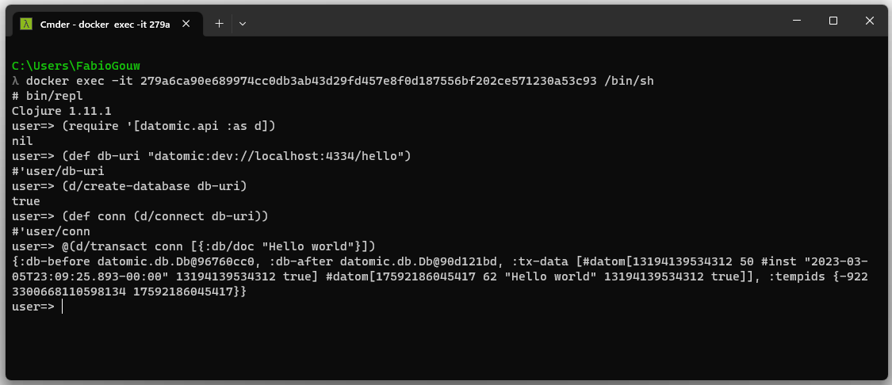

# Datomic Starter docker image

This repository contains the source code for a docker image for running Datomic Starter edition. I made this one to easily spin up a dev / test environment, so I can use it to run integration tests using libraries like [Test Containers](https://www.testcontainers.org/).

This image is based on the clojure official image. It starts both the Datomic's transactor (the one that receives the writes requests and stores them) and the [Datomic console](https://docs.datomic.com/on-prem/other-tools/console.html), so I can use it to query the database.

After cloning the repo, in the terminal using a machine that has Docker installed, go to the *src* folder and run the command below, replacing the following parameters:
- **datomic_version** - the Datomic version you want to use. It's optional and if not provided, the default value is 1.0.6726

All these information can be obtained in Datomic's account page.

``` bash
docker build -t my-datomic-starter:0.1 --build-arg datomic_version={{datomic_version}} . 
```

As an example:

``` bash
docker build -t my-datomic-starter:0.1 --build-arg datomic_version=1.0.6726 . 
```

To run, you just need to create the container.

``` bash
docker run -d -p 8080:8080 -p 4334:4334 my-datomic-starter:0.1
```

Go to [http://localhost:8080/browse](http://localhost:8080/browse) and you'll have access to the Datomic console. Also, you can connect to the containter to get access to the shell and start a new REPL instance to interact with Datomic (in the image below, there's and exemple on how to do it and create a new database and insert some datoms on it).

